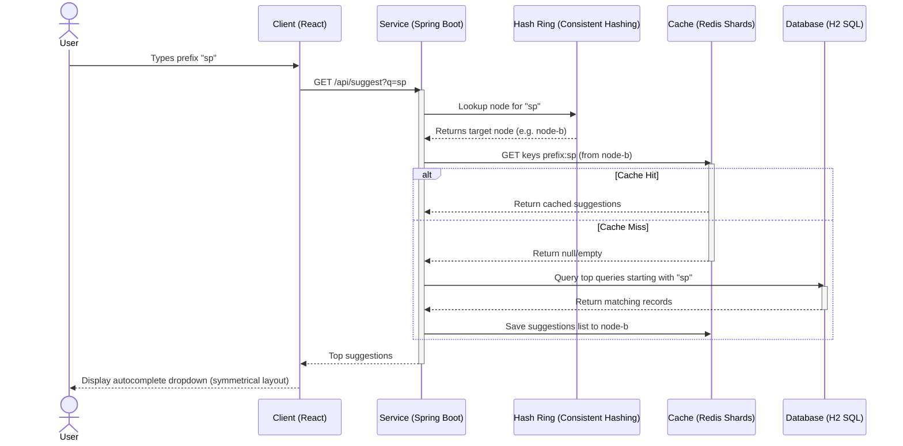

# Search Autocomplete (Typeahead) System

A backend-focused search typeahead (autocomplete) system that balances low-latency reads with database-friendly write throughput, featuring a distributed sharded cache and trending search boosts.

---

## Autocomplete Request Workflow

Below is the request-response sequence when a user types a prefix into the client:



---

## Technology Stack

- **Backend**: Java 17 (Spring Boot 3.2.5) with Spring Data JPA and Spring Data Redis
- **Frontend**: React + Vite (Vanilla CSS, debounced hooks, soft light UI)
- **Database (Source of Truth)**: H2 in-memory relational database
- **Distributed Cache**: Redis (Dockerized), sharded across 3 logical cache nodes (`node-a`, `node-b`, `node-c`) via consistent hashing
- **Dataset**: Top 100,000+ unique aggregated queries extracted and normalized from the real-world **AOL User Session Collection** (3.5M+ raw search logs).

---

## Prerequisites

- Java 17 or higher
- Maven 3.8+
- Node.js 18+
- Docker & Docker Compose
- Python 3.x

---

## How to Run (Step-by-Step)

### 1. Generate Dataset
Navigate to the dataset directory and run the processing script:
```bash
cd dataset
python process_aol_dataset.py
```
This downloads the raw AOL log archive, extracts it, normalizes and aggregates the search terms, and writes the top 100,000 unique queries by frequency to `seed_queries.csv`.

### 2. Start Redis Cache
Start the sharded cache instance in Docker:
```bash
docker-compose up -d
```
This runs a Redis instance on `localhost:6379`.

### 3. Start Backend Application
Navigate to the backend directory and run the Spring Boot app:
```bash
cd backend
mvn spring-boot:run
```
Upon startup, `DataSeeder.java` reads `seed_queries.csv`, populates the H2 database, and pre-builds the prefix-to-suggestion map, distributing items across the three Redis cache nodes using consistent hashing.

### 4. Start Frontend Client
Navigate to the frontend directory, install dependencies, and launch the dev server:
```bash
cd frontend
npm install
npm run dev
```
Open `http://localhost:5173` in your browser.

---

## API Documentation

### 1. Suggest API
Retrieve top-10 suggestions starting with the prefix.
* **URL**: `/api/suggest`
* **Method**: `GET`
* **Params**: `q=[prefix]`
* **Response**:
  ```json
  [
    { "query": "google", "score": 39597 },
    { "query": "google.com", "score": 9530 }
  ]
  ```

### 2. Search Submission API
Record a new search query (enqueued in batch service for aggregation).
* **URL**: `/api/search`
* **Method**: `POST`
* **Body**: `{"query": "iphone"}`
* **Response**:
  ```json
  {
    "status": "success",
    "message": "Searched successfully",
    "query": "iphone"
  }
  ```

### 3. Trending Searches API
Get top trending searches, including recent search boosts.
* **URL**: `/api/trending`
* **Method**: `GET`
* **Params**: `limit=[int]` (default 10)
* **Response**:
  ```json
  [
    { "query": "google", "score": 39597 },
    { "query": "yahoo", "score": 17579 }
  ]
  ```

### 4. Cache Debug API
Inspect which Redis node contains the prefix data and verify hit/miss behavior.
* **URL**: `/api/cache/debug`
* **Method**: `GET`
* **Params**: `prefix=[prefix]`
* **Response**:
  ```json
  {
    "prefix": "iph",
    "cacheNode": "node-b",
    "hit": true,
    "suggestions": [...]
  }
  ```

---

## Design Decisions & Engineering Trade-offs

### 1. Pre-computed Prefix Cache vs. Dynamic Trie Querying
* **Decision**: We map every input prefix (e.g., `i` -> `ip` -> `iph` -> `ipho` -> `iphon` -> `iphone`) directly to its top-10 complete suggestions inside Redis.
* **Trade-off**: Storing all prefixes yields a higher memory footprint in Redis since queries generate $L$ separate prefix records. However, this shifts computation from query-time to write-time. Lookup times are absolute $O(1)$ hash fetches, guaranteeing sub-millisecond response times.

### 2. TreeMap Ring Consistent Hashing vs. Simple Modulo Sharding
* **Decision**: We distribute prefix caches across 3 Redis nodes using a TreeMap consistent hash ring with 150 virtual nodes per physical host.
* **Trade-off**: Virtual nodes ring mapping incurs a minor $O(\log V)$ CPU routing lookup overhead compared to basic $O(1)$ modulo hashing. In return, it completely mitigates hot-spotting, ensures uniform key distribution, and avoids cascading cache misses/invalidation during scaling (adding/removing Redis nodes).

### 3. Batch Write Buffer vs. Real-Time SQL Seeding
* **Decision**: Incoming search writes are enqueued in-memory using a thread-safe `ConcurrentLinkedQueue`. A scheduled service (`BatchService`) flushes them to the H2 SQL database in bulk every 5 seconds.
* **Trade-off**: There is a minimal durability trade-off: if the server crashes, search counts enqueued in the last 5 seconds of the memory queue are lost. However, this protects the relational database from write-starvation and locking contentions under heavy concurrent autocomplete submission traffic.

### 4. Application-Managed Routing vs. Redis Cluster
* **Decision**: We manage consistent hashing routing directly inside Spring Boot application code.
* **Trade-off**: This adds sharding and ring-state management logic into the service layer rather than offloading it to the cache layer. However, it completely eliminates the complex operations, configuration overhead, and multi-node coordination requirements of a standard Redis Cluster.

---

## Screenshort


## Complexity Analysis

| Operation | Time Complexity | Details |
|---|---|---|
| **Autocomplete Suggest** | $O(1)$ | Direct HGET key-value fetch |
| **Search Submission** | $O(1)$ | ConcurrentLinkedQueue insert |
| **Batch Aggregation** | $O(N)$ | Aggregate query map ($N$ is queue size) |
| **Consistent Hash Ring Routing** | $O(\log M)$ | TreeMap ceilingEntry lookup ($M$ is virtual nodes count) |
